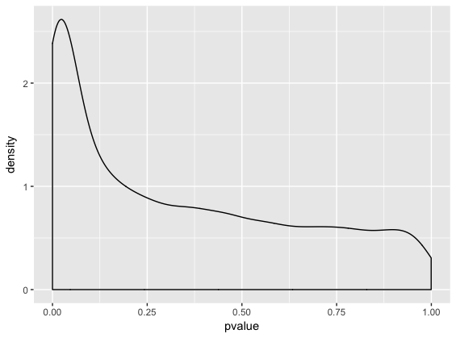

**update Dec 29th, 2020, 12:10PM** 

The following sections are to be submitted for marks:

- Part 2 Exercise
- Part 3 Exercise
- Part 4 Exercise

# Objectives

The objectives for this lecture will be to

-  Understand that some freely available genomic, transcriptomic and proteomic data can be accessed through the Gene Expression Omnibus server (GEO)
-  Download gene expression datasets using GEOquery and explore the data using dplyr verbs
-  Use dplyr verbs in conjunction with ggplot2
-  Run a t-test and isolate the results in a table

# Part 1 - Accessing data using GEOquery

All of the packages you will need are listed below. If you have never used them before, you will need to install them using the commented lines above the library() command. 

```{r, results='hide', message=FALSE, warning=FALSE}
#if (!requireNamespace("BiocManager", quietly = TRUE))
#    install.packages("BiocManager")
#
#BiocManager::install("GEOquery")
#BiocManager::install("biomaRt")
library(GEOquery)
library(biomaRt)
#install.packages("tidyverse")
library(tidyverse)
#install.packages("data.table")
library(data.table)
```

A variety of freely available gene expression data is available through the Gene Expression Omnibus (GEO) server. Most of these datasets have associated papers in which they detail data acquisition and analysis methods. 

To simplify things for its users, GEO has four basic entities that act as containers for different types of data. The four main types are:

**GSM** - stores data associated with a single sample, and additional info about how the data was collected

**GSE** - stores information about each sample, as well as overall experiment info 

**GPL** - stores platform info (i.e the machine used to collect the data)

**GDS** - stores curated matrices that are GSM objects in an "analysis-ready" format

The first thing we are going to do is download a dataset from the Gene Expression Omnibus (GEO) repository using the GEOquery package. This experiment is exploring gene expression differences between renal cell carcinoma cells (RCC) and adjacent normal cells using an Affymetric array. We are going to download data in the GDS format, as it is already in a nice table for us. Note: you can download any type of GEO data you want using the getGEO function. 

```{r}
gds <- getGEO("GDS507")
#we can use str() to peak at the structure of a data object. 
str(gds)
```

You can see that the GDS object has many different slots in which to put data. For example, our GDS file has a slot for information about the machine (@GPL), meta data and actual gene expression (@data.table) and information about the experiment and its authors (@header). 

The first thing we want to do is extract a meta data table, and a gene expression table. 
```{r}
meta_data <- data.frame(Sample = gds@dataTable@columns$sample, disease = gds@dataTable@columns$disease.state)
#we grab this info from the appropriate slots above. 

gds_data <- gds@dataTable@table
```

# Part 2 - Exploring a gene expression dataset

Let's peak at the data to see its structure using head(). This gives us the first few rows of the dataset. 

```{r}
head(gds_data)
nrow(gds_data)
ncol(gds_data)
```

In our data frame, the first two columns correspond to gene names. ID_REF refers to the probe name. IDENTIFIER refers to the gene name to which this probe maps. The remaining columns contain expression values for the 17 samples. In summary, we have an array with dimensions 22645 x 19 (row x column).

Notice that some gene names are duplicated, because there are multiple probes that map to the same gene. We will deal with this later! 

Now we can start exploring the dataset a bit. Just for fun - let's compute the average count in each sample. 

We will do this using a function called apply() in base R. 

```{r}
#We exclude the first and second columns because they hold the probe and gene names, respectively. 
apply(gds_data[,-c(1, 2)], 2, median)
```

apply() is useful, but it is limited in that it can only operate on rows, columns, or individual elements of a dataframe directly. More complex operations get get cumbersome. 

## dplyr

One more versatile set of tools are the **dplyr verbs**. These are a set of functions designed for easy manipulation of data. 

They are: 

* **%>%** - Syntactic sugar for easily piping the result of one function into another. 
* **dplyr::group_by()** - Commonly used with summarize() to derive summarized values for multiple rows sharing certain attributes  
* **dplyr::summarize()** - summarize certain statistics from the data (i.e mean, median, mode, number of samples) 

**filter** - extract rows that meet certain criteria from data frame

**select** - extract columns that meet certain criteria from data frame

**mutate** - add a new column 

**arrange** - arrange the data in descending or ascending order

**join** - a set of methods to combine two tidy datasets, roughly corresponding to typical notions of database joins, see the [join page](https://dplyr.tidyverse.org/reference/join.html) of the tidyverse reference for more information

Most, if not all, of these operations are available in the `data.table` package, albeit in a less readable syntax. This package was developed to quickly read, write, and manipulate large amounts of data. If you plan to work with large sets of features, it may be helpful to consider learning this framework as well. See the [Introduction to data.table](https://cran.r-project.org/web/packages/data.table/vignettes/datatable-intro.html) vignette for more information.

An important thing to know about the dplyr verbs, and data.table for that matter) is that they will only work on data frames that meet certain structural criteria. Namely, each variable must be in its own column. In data science, we call this "tidy" data. 

Let's look at a few small datasets that are "tidy".

```{r}
head(iris) #data describing flower parts for several species
head(band_members) #Members of the Beatles and Rolling Stones
head(band_instruments) #Instruments of the above band members
```

The iris dataset contains information about certain species of flowers. 

As you can see, each variable has its own column, and each row is an instance of that variable. There are no rownames. We can now use dplyr verbs to manipulate the data. 

These verbs can be used together in a sequence of functions with the "pipe" operator. R will interpret the output of the previous function as the input to the subsequent function when you put the "pipe" operator ( %>% ) in between the functions. 


## Part 0: dplyr 

In case you haven't seen the `summarize()` function before - it is one of the most handy functions in the dplyr package. Used with `group_by()`, you can easily find out summary values like mean, median, min, and max for certain variables for different groups. Very soon, you will have another seminar that introduces the dplyr package more formally. Bear with me for now!

Also, this symbol: **%>%** is called a "pipe". It is a syntactic sugar that simply takes the object on its left and feeds it into the function call on its right. This way, you can "pipe" an input through sequence of function calls, where output of the previous function call is fed into the next function call as its input. This makes for much more readable code.

For example, this:

    foo0(input)
    
becomes this:

    input %>% 
      foo0()
    
and this: 

    foo2(foo1(foo0(input)))
    
becomes this:

    input %>% 
      foo0() %>% 
      foo1() %>% 
      foo2()

To read more about pipes click [here](http://r4ds.had.co.nz/pipes.html).


```{r} 
mpg %>% 
  group_by(class) %>% 
  summarise(fuel_efficiency = mean(hwy))
```

```{r}
#select all rows with sepal length greater than 5. 
iris %>% 
	filter(Sepal.Length > 5) %>% 
	head()

#group all rows of the same species together.
iris %>% 
	group_by(Species) %>% 
	head()

#select the column called "Sepal.Width"
iris %>% 
	dplyr::select(Sepal.Width) %>% 
	head()

#create another column with the species name capitalized. 
iris %>%
	group_by(Species) %>% 
	mutate(Capitalized_names = toupper(Species)) %>% 
	head()

#summarize the average sepal length and number of rows belonging to each species.
iris %>% 
	group_by(Species) %>% 
	summarize(average_sepal_length = mean(Sepal.Length), n = n()) %>% 
	head()

#arrange the species in alphabetical order
iris %>% 
	arrange(desc(Species)) %>% 
	head()

#join band members with their instruments by "name"
band_members %>% left_join(band_instruments) 

band_members %>% right_join(band_instruments)

band_members %>% full_join(band_instruments)
```

Now let's apply these functions to our gene expression dataset!

One problem: our dataset is not "tidy". Rather, it's arranged like an excel spreadsheet. While intuitive for us to read, dplyr does not like this very much. So, we have to change it so that each row contains only one expression value. Luckily, the `pivot_longer()` function from the 'tidyr' package helps out with that. 

```{r}
long_data <- pivot_longer(gds_data, 
                          cols = 3:19,
                          values_to = "Expression",
                          names_to = "Sample")
```

It's hard to describe what this function does. You can see that the first ~20,000 rows will correspond to data from the first gene identifier, and the next group of rows will correspond to data from the second gene identifier/ You can think of this function as stretching out a dataset into its long form, so that each row has only one expression value. I would suggest reading [this](https://tidyr.tidyverse.org/reference/pivot_longer.html) for more information about what the `pivot_longer()` function does. 

Now we have four columns, each one corresponding to a variable: the probe name, the gene name, the sample name and the count. 

We can do a lot of stuff with this setup! Let's calculate the mean gene expression per sample. 

```{r}
long_data %>% 
	group_by(Sample) %>% 
	summarize(mean = mean(Expression))
```

Another thing we note is that there are multiple probes that map to a specific gene. In a real life analysis workflow, there are multiple ways to deal with this. Some popular options include picking the probe with the highest expression, or taking the mean/median of all probes' expression. For simplicity, we will use summarize() to take the mean of each probe's expression. 

```{r}
(new_long_data<- long_data %>% 
	group_by(Sample, IDENTIFIER) %>% 
	summarize(Count = mean(Expression)))
```

Now, every gene will only have one value per sample. 

Now that we are more familiar with dplyr verbs, we can explore how to access information about genes we are interested in. 

The `biomaRt` package is very useful in this regard. It accesses the ensembl database of gene names and annotations (ensembl.org). `biomaRt` can help us convert ensemble ids (eg. ENSGXXXXX) into HGNC symbols (i.e BRCA1), for example, along with a host of other things. 

Say we want to learn more about the gene expression on a particular chromosome, across all samples. We can use biomaRt to look up the chromosomal location of each gene. Read the biomaRt manual for more detailed explanation of the following bit of code.

```{r}
#open connection between biomaRt and R. 
human = useMart("ensembl", dataset = "hsapiens_gene_ensembl")
#function that takes in data frame, and outputs same data frame with associated chromosome annotations.
identify_gene_names <- function(df){
	names(df) <- c("Sample", "hgnc_symbol", "Count")
	names <- getBM( attributes=c("hgnc_symbol", "chromosome_name") , filters= "hgnc_symbol", values = unique(df$hgnc_symbol), mart = human, useCache = FALSE)
	left_join(df, names, by = "hgnc_symbol")
}

#There's a lot of variation in how the chromosomal location is annotated. To simplify things, let's filter out all genes with annotations that are not numeric numbers between 1 and 23, X or Y. 
data_with_chromosome <- identify_gene_names(new_long_data) %>% 
	filter(chromosome_name %in% c(1:23, "X", "Y"))
```

## Part 2 Exercise

*Modify the above code to also identify the length of each gene captured in the dataset we have been working with in the above exercises. This can be done by adding  "transcript_length" as  attribute in getBM function. You should end up with an extra column for "transcript length". We will use this number later.*

Let's say we're interested in how the average expression of genes on the X chromosome changes between RCC and normal cells. 

The first thing we will do is combine information from the meta data file (meta_data) with our expression table (data_with_chromosome). Then we will use dplyr verbs to first group all samples by disease status, filter out all non-X-chromosome genes, and then calculate the mean using summarize(). 

```{r}
full_data <- left_join(data_with_chromosome, meta_data, by = "Sample")

full_data %>% 
	group_by(disease) %>% 
	filter(chromosome_name == "X") %>% 
	summarize(mean = mean(Count))
```

# Part 3: Graphing expression data

What if we want to graph our count data? Time for ggplot! 

Because we can't graph all of the probes, let's choose a random sampling of 100. 

```{r}
#choose random number between 1 and however many genes we have. 
set.seed(5747540)
sample_to_choose <- sample(1:length(unique(full_data$hgnc_symbol)), size = 100)
#choose genes that correspond to those numbers in a list of genes. 
names_to_choose <- as.character(unique(full_data$hgnc_symbol)[sample_to_choose])

full_data %>% 
	filter(hgnc_symbol %in% names_to_choose) %>% 
	group_by(Sample) %>% 
	ggplot(aes(x = as.factor(chromosome_name), y = Count)) + geom_point()
```

## Part 3 Exercise

By adding one additional function to full_data ("data_with_chromosome") data frame above, calculate the sum of all gene counts in each sample and divide each expression value by that sum (hint: use mutate). 

Remember, you can add multiple new columns using mutate by separating each column with a comma (i.e mutate(x = c("a", "b"), y = c("d", "c"))). Plot this new transformed column.

As an optional exercise, what would be the consequence if we use the data frame with the "transcription_length" column?


# Part 4 - Analyzing the results of statistical tests

Being able to graph these results is useful, but what we really want to do is run statistical tests on the data. There are a variety of ways to do that which will be explored in subsequent lectures. But in this seminar we will focus on doing this using dplyr. 

In this case, we want to identify the genes that are differentially expressed between the normal and RCC samples. We will use summarize() to perform a t-test for each gene. 

```{r}
full_data %>% 
	group_by(hgnc_symbol) %>% 
	summarize( pvalue = t.test(Count ~ disease)$p.value)
```

## Part 4 Exercise - Take home

*Make a density plot using geom_density() graph of the p-value distributions of the above t-test. It should look like this:*



*Note that if you acquired transcript lengths, you should NOT be using that data frame for this task. Can you see why?*

*Also, extract a data frame of all genes with p-values lower than 0.05. Finally, extract the name of the gene with the lowest p-value.*
