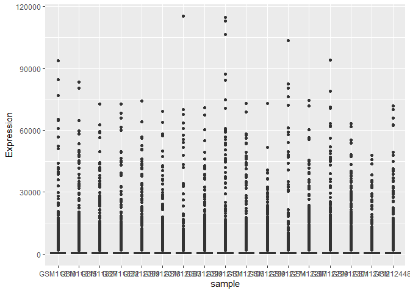
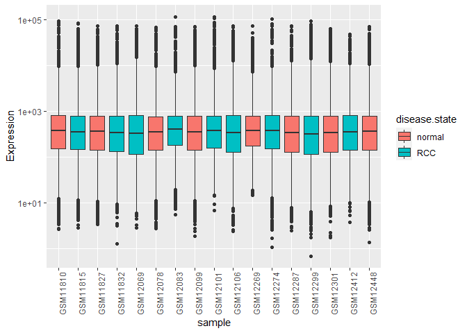
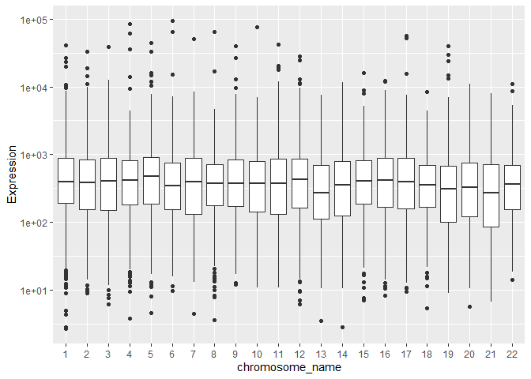
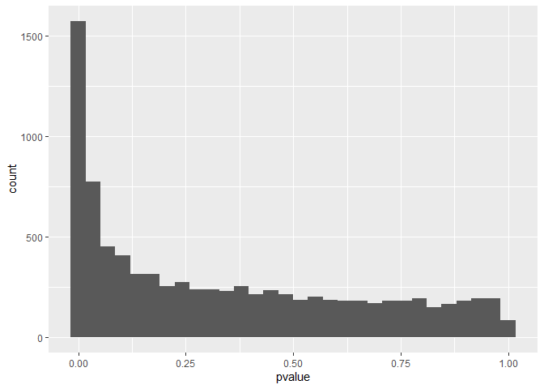

# STAT 540 - Seminar 3: Reading in data and manipulating with dplyr

# Objectives

The objectives for this lecture will be to

-   Understand that some freely available genomic, transcriptomic and
    proteomic data can be accessed through the [Gene Expression Omnibus
    (GEO)](https://www.ncbi.nlm.nih.gov/geo/)
-   Explore and manipulate data using `dplyr` and `tidyr` verbs
-   Use `dplyr` verbs in conjunction with `ggplot2` to visualize aspects
    of the data

# Packages required

All of the packages you will need are listed below. If you have never
used them before, you will need to install them using the commented
lines above the library() command.

``` r
library(GEOquery)
library(biomaRt)
library(tidyverse)
```

# Part 1 - Accessing data using GEOquery

A variety of freely available gene expression data is available through
the Gene Expression Omnibus (GEO) server. Most of these datasets have
associated papers in which they detail data acquisition and analysis
methods.

To simplify things for its users, GEO has four basic entities that act
as containers for different types of data. The four main types are:

**GSM** - stores data associated with a single sample, and additional
info about how the data was collected

**GSE** - stores information about each sample, as well as overall
experiment info

**GPL** - stores platform info (i.e the machine used to collect the
data)

**GDS** - stores curated matrices that are GSM objects in an
“analysis-ready” format

In this seminar, we’ll read in a **GDS**, and next seminar we’ll work
with a **GSE**.

The first thing we are going to do is download a dataset from the Gene
Expression Omnibus (GEO) repository using the GEOquery package. This
experiment is exploring gene expression differences between renal cell
carcinoma cells (RCC) and adjacent normal cells using an Affymetric
array. We are going to download data in the GDS format, as it is already
in a nice table for us. Note: you can download any type of GEO data you
want using the getGEO function.

``` r
gds <- getGEO("GDS507")
#we can use str() to peak at the structure of a data object. 
str(gds)
```

    ## Formal class 'GDS' [package "GEOquery"] with 3 slots
    ##   ..@ gpl      :Formal class 'GPL' [package "GEOquery"] with 2 slots
    ##   .. .. ..@ dataTable:Formal class 'GEODataTable' [package "GEOquery"] with 2 slots
    ##   .. .. .. .. ..@ columns:'data.frame':  0 obs. of  0 variables
    ##   .. .. .. .. ..@ table  :'data.frame':  0 obs. of  0 variables
    ##   .. .. ..@ header   : list()
    ##   ..@ dataTable:Formal class 'GEODataTable' [package "GEOquery"] with 2 slots
    ##   .. .. ..@ columns:'data.frame':    17 obs. of  4 variables:
    ##   .. .. .. ..$ sample       : chr [1:17] "GSM11815" "GSM11832" "GSM12069" "GSM12083" ...
    ##   .. .. .. ..$ disease.state: Factor w/ 2 levels "normal","RCC": 2 2 2 2 2 2 2 2 2 1 ...
    ##   .. .. .. ..$ individual   : Factor w/ 10 levels "001","005","011",..: 6 4 1 2 3 5 8 9 10 6 ...
    ##   .. .. .. ..$ description  : chr [1:17] "Value for GSM11815: C035 Renal Clear Cell Carcinoma U133B; src: Trizol isolation of total RNA from Renal Clear "| __truncated__ "Value for GSM11832: C023 Renal Clear Cell Carcinoma U133B; src: Trizol isolation of total RNA from Renal Clear "| __truncated__ "Value for GSM12069: C001 Renal Clear Cell Carcinoma U133B; src: Trizol isolation of total RNA from Renal Clear "| __truncated__ "Value for GSM12083: C005 Renal Clear Cell Carcinoma U133B; src: Trizol isolation of total RNA from Renal Clear "| __truncated__ ...
    ##   .. .. ..@ table  :'data.frame':    22645 obs. of  19 variables:
    ##   .. .. .. ..$ ID_REF    : chr [1:22645] "200000_s_at" "200001_at" "200002_at" "200003_s_at" ...
    ##   .. .. .. ..$ IDENTIFIER: chr [1:22645] "PRPF8" "CAPNS1" "RPL35" "MIR6805" ...
    ##   .. .. .. ..$ GSM11815  : num [1:22645] 4254 17996 41679 65391 19030 ...
    ##   .. .. .. ..$ GSM11832  : num [1:22645] 5298 12011 39117 34806 15814 ...
    ##   .. .. .. ..$ GSM12069  : num [1:22645] 4026 10284 38759 31257 16356 ...
    ##   .. .. .. ..$ GSM12083  : num [1:22645] 3498 2535 32848 28308 9580 ...
    ##   .. .. .. ..$ GSM12101  : num [1:22645] 3566 11048 39634 67448 14274 ...
    ##   .. .. .. ..$ GSM12106  : num [1:22645] 4903 13354 43511 56990 17217 ...
    ##   .. .. .. ..$ GSM12274  : num [1:22645] 6373 8564 46857 57972 19117 ...
    ##   .. .. .. ..$ GSM12299  : num [1:22645] 4829 17248 47032 57570 17488 ...
    ##   .. .. .. ..$ GSM12412  : num [1:22645] 5206 16018 22152 29062 14672 ...
    ##   .. .. .. ..$ GSM11810  : num [1:22645] 2757 6077 26661 35141 17733 ...
    ##   .. .. .. ..$ GSM11827  : num [1:22645] 3932 15704 26374 23629 18022 ...
    ##   .. .. .. ..$ GSM12078  : num [1:22645] 3730 10138 23810 22100 17957 ...
    ##   .. .. .. ..$ GSM12099  : num [1:22645] 3223 11614 24749 21651 15958 ...
    ##   .. .. .. ..$ GSM12269  : num [1:22645] 3640 8460 21937 18551 15800 ...
    ##   .. .. .. ..$ GSM12287  : num [1:22645] 4886 10283 31463 23496 16686 ...
    ##   .. .. .. ..$ GSM12301  : num [1:22645] 4070 11844 22734 21315 18817 ...
    ##   .. .. .. ..$ GSM12448  : num [1:22645] 3482 9742 25396 28631 17421 ...
    ##   ..@ header   :List of 23
    ##   .. ..$ channel_count           : chr "1"
    ##   .. ..$ dataset_id              : chr [1:12] "GDS507" "GDS507" "GDS507" "GDS507" ...
    ##   .. ..$ description             : chr [1:13] "Investigation into mechanisms of renal clear cell carcinogenesis (RCC). Comparison of renal clear cell tumor ti"| __truncated__ "RCC" "normal" "035" ...
    ##   .. ..$ email                   : chr "geo@ncbi.nlm.nih.gov"
    ##   .. ..$ feature_count           : chr "22645"
    ##   .. ..$ institute               : chr "NCBI NLM NIH"
    ##   .. ..$ name                    : chr "Gene Expression Omnibus (GEO)"
    ##   .. ..$ order                   : chr "none"
    ##   .. ..$ platform                : chr "GPL97"
    ##   .. ..$ platform_organism       : chr "Homo sapiens"
    ##   .. ..$ platform_technology_type: chr "in situ oligonucleotide"
    ##   .. ..$ pubmed_id               : chr "14641932"
    ##   .. ..$ ref                     : chr "Nucleic Acids Res. 2005 Jan 1;33 Database Issue:D562-6"
    ##   .. ..$ reference_series        : chr "GSE781"
    ##   .. ..$ sample_count            : chr "17"
    ##   .. ..$ sample_id               : chr [1:12] "GSM11815,GSM11832,GSM12069,GSM12083,GSM12101,GSM12106,GSM12274,GSM12299,GSM12412" "GSM11810,GSM11827,GSM12078,GSM12099,GSM12269,GSM12287,GSM12301,GSM12448" "GSM11810,GSM11815" "GSM11827,GSM11832" ...
    ##   .. ..$ sample_organism         : chr "Homo sapiens"
    ##   .. ..$ sample_type             : chr "RNA"
    ##   .. ..$ title                   : chr "Renal clear cell carcinoma (HG-U133B)"
    ##   .. ..$ type                    : chr [1:13] "Expression profiling by array" "disease state" "disease state" "individual" ...
    ##   .. ..$ update_date             : chr "Mar 04 2004"
    ##   .. ..$ value_type              : chr "count"
    ##   .. ..$ web_link                : chr "http://www.ncbi.nlm.nih.gov/geo"

You can see that the GDS object is quite complex, and has many different
slots in which to put data. For example, our GDS file has a slot for
information about the machine (@GPL), meta data and actual gene
expression (@data.table) and information about the experiment and its
authors (@header). You could work with this and find the relevant
data/info, but we’ll convert it to a more recognizable object using the
`GEOquery::GDS2eSet()` function. This function converts the GDS data
structure above to an `ExpressionSet` object.

``` r
eset <- GDS2eSet(gds)
eset
```

    ## ExpressionSet (storageMode: lockedEnvironment)
    ## assayData: 22645 features, 17 samples 
    ##   element names: exprs 
    ## protocolData: none
    ## phenoData
    ##   sampleNames: GSM11815 GSM11832 ... GSM12448 (17 total)
    ##   varLabels: sample disease.state individual description
    ##   varMetadata: labelDescription
    ## featureData
    ##   featureNames: 200000_s_at 200001_at ... AFFX-TrpnX-M_at (22645 total)
    ##   fvarLabels: ID Gene title ... GO:Component ID (21 total)
    ##   fvarMetadata: Column labelDescription
    ## experimentData: use 'experimentData(object)'
    ##   pubMedIds: 14641932 
    ## Annotation:

This format is really handy for downstream analyses, and we’ll dissect
its contents in much more detail in next seminar. But for now, we’ll
simply pull out the expression data matrix, sample metadata, and feature
metadata into separate objects - don’t worry about the details of this
next chunk just yet.

``` r
# get sample metadata with the pData() function
meta_data <- pData(eset)

# get expression data with the exprs() function
expr_mat <- exprs(eset)

# get feature info (probe/gene id)
feat_data <- featureData(eset)
```

# Part 2 - Exploring a gene expression dataset

Let’s peak at the data to see its structure using `head()`. This gives
us the first few rows of the dataset.

``` r
head(expr_mat)
```

    ##             GSM11815 GSM11832 GSM12069 GSM12083 GSM12101 GSM12106 GSM12274
    ## 200000_s_at   4254.0   5298.2   4026.5   3498.4   3566.4   4903.1   6372.6
    ## 200001_at    17996.2  12010.7  10283.5   2534.7  11048.4  13354.0   8563.8
    ## 200002_at    41678.8  39116.9  38758.9  32847.7  39633.9  43511.2  46856.7
    ## 200003_s_at  65390.9  34806.2  31257.2  28308.5  67447.5  56989.9  57972.5
    ## 200004_at    19030.1  15813.6  16355.7   9579.7  14273.5  17217.0  19116.9
    ## 200005_at     8824.5   9706.2  10590.0   6986.7   9400.4  12835.2  10299.0
    ##             GSM12299 GSM12412 GSM11810 GSM11827 GSM12078 GSM12099 GSM12269
    ## 200000_s_at   4829.1   5205.8   2756.8   3932.0   3729.9   3223.4   3640.5
    ## 200001_at    17247.6  16018.5   6077.0  15703.8  10138.5  11614.4   8460.5
    ## 200002_at    47032.4  22152.2  26660.7  26373.6  23809.6  24749.3  21936.8
    ## 200003_s_at  57570.5  29062.2  35140.9  23629.3  22100.5  21651.0  18550.7
    ## 200004_at    17487.6  14671.6  17733.1  18022.4  17957.4  15958.0  15799.8
    ## 200005_at    12375.2   7645.4   8661.5   7355.7   6973.4   6855.9   7949.2
    ##             GSM12287 GSM12301 GSM12448
    ## 200000_s_at   4886.3   4070.2   3482.1
    ## 200001_at    10282.6  11844.3   9741.6
    ## 200002_at    31462.8  22733.7  25395.5
    ## 200003_s_at  23496.5  21315.4  28631.4
    ## 200004_at    16685.8  18817.3  17421.1
    ## 200005_at     9486.5   7494.5   7252.1

``` r
dim(expr_mat)
```

    ## [1] 22645    17

``` r
dim(meta_data)
```

    ## [1] 17  4

``` r
dim(feat_data)
```

    ##   featureNames featureColumns 
    ##          22645             21

In our expression matrix, the row names correspond to probe IDs. The
columns contain expression values for the 17 samples. In summary, we
have an array with dimensions 22645 x 17 (row x column). The sample
metadata has 17 rows - one for each sample. And the feature meta data
has 22645 rows - one for each probe.

Taking a look at our sample and feature metadata, we can see we have
information about each sample’s disease state, and that we have a lot of
annotation about each of our probes (Various Gene
symbols/IDs/Accessions, Chromosome, and functional processes).

``` r
head(meta_data)
```

    ##            sample disease.state individual
    ## GSM11815 GSM11815           RCC        035
    ## GSM11832 GSM11832           RCC        023
    ## GSM12069 GSM12069           RCC        001
    ## GSM12083 GSM12083           RCC        005
    ## GSM12101 GSM12101           RCC        011
    ## GSM12106 GSM12106           RCC        032
    ##                                                                                                                                   description
    ## GSM11815 Value for GSM11815: C035 Renal Clear Cell Carcinoma U133B; src: Trizol isolation of total RNA from Renal Clear Cell Carcinoma tissue
    ## GSM11832 Value for GSM11832: C023 Renal Clear Cell Carcinoma U133B; src: Trizol isolation of total RNA from Renal Clear Cell Carcinoma tissue
    ## GSM12069 Value for GSM12069: C001 Renal Clear Cell Carcinoma U133B; src: Trizol isolation of total RNA from Renal Clear Cell Carcinoma tissue
    ## GSM12083 Value for GSM12083: C005 Renal Clear Cell Carcinoma U133B; src: Trizol isolation of total RNA from Renal Clear Cell Carcinoma tissue
    ## GSM12101 Value for GSM12101: C011 Renal Clear Cell Carcinoma U133B; src: Trizol isolation of total RNA from Renal Clear Cell Carcinoma tissue
    ## GSM12106 Value for GSM12106: C032 Renal Clear Cell Carcinoma U133B; src: Trizol isolation of total RNA from Renal Clear Cell Carcinoma tissue

``` r
colnames(feat_data)
```

    ##  [1] "ID"                    "Gene title"            "Gene symbol"          
    ##  [4] "Gene ID"               "UniGene title"         "UniGene symbol"       
    ##  [7] "UniGene ID"            "Nucleotide Title"      "GI"                   
    ## [10] "GenBank Accession"     "Platform_CLONEID"      "Platform_ORF"         
    ## [13] "Platform_SPOTID"       "Chromosome location"   "Chromosome annotation"
    ## [16] "GO:Function"           "GO:Process"            "GO:Component"         
    ## [19] "GO:Function ID"        "GO:Process ID"         "GO:Component ID"

``` r
# how many unique gene symbols are there?
length(unique(feat_data$'Gene symbol'))
```

    ## [1] 10760

Note that some gene names are duplicated, because there are multiple
probes that map to the same gene. We will deal with this later!

Now we can start exploring the dataset a bit. Just for fun - let’s
compute the average count in each sample.

We will do this using a function called `apply()` in base R.

``` r
#We exclude the first and second columns because they hold the probe and gene names, respectively. 
apply(expr_mat, 2, median)
```

    ## GSM11815 GSM11832 GSM12069 GSM12083 GSM12101 GSM12106 GSM12274 GSM12299 
    ##    265.6    250.3    218.5    309.7    281.9    240.1    280.2    217.0 
    ## GSM12412 GSM11810 GSM11827 GSM12078 GSM12099 GSM12269 GSM12287 GSM12301 
    ##    264.4    273.8    264.6    266.5    269.3    288.6    238.7    244.5 
    ## GSM12448 
    ##    264.3

`apply()` is useful, but it is limited in that it can only operate on
rows, columns, or individual elements of a dataframe directly. More
complex operations get cumbersome.

# Part 3: Manipulations with `dplyr` and `tidyr`

One more versatile set of tools are the **`dplyr` verbs**. These are a
set of functions designed for easy manipulation of data.

They are:

-   **`%>%`** - Syntactic sugar for easily piping the result of one
    function into another.
-   **`dplyr::group_by()`** - Commonly used with summarize() to derive
    summarized values for multiple rows sharing certain attributes  
-   **`dplyr::summarize()`** - summarize certain statistics from the
    data (i.e mean, median, mode, number of samples)

**`dplyr::filter()`** - extract rows that meet certain criteria from
data frame

**`dplyr::select()`** - extract columns that meet certain criteria from
data frame

**`dplyr::mutate()`** - add a new column

**`dplyr::arrange()`** - arrange the data in descending or ascending
order

**`dplyr::left_join()`**, **`dplyr::right_join()`**, etc - a set of
methods to combine two tidy datasets, roughly corresponding to typical
notions of database joins, see the [join
page](https://dplyr.tidyverse.org/reference/mutate-joins.html) of the
tidyverse reference for more information

**`tidyr::pivot_longer()`** - “lengthens” data by collapsing several
columns into two

Most, if not all, of these operations are available in the `data.table`
package, albeit in a less readable syntax. This package was developed to
quickly read, write, and manipulate large amounts of data. If you plan
to work with large sets of features, it may be helpful to consider
learning this framework as well. See the [Introduction to
data.table](https://cran.r-project.org/web/packages/data.table/vignettes/datatable-intro.html)
vignette for more information. The [`dtplyr`
package](https://www.tidyverse.org/blog/2019/11/dtplyr-1-0-0/) is a
package that unifies `dplyr` syntax with a `data.table` backend.

An important thing to know about the `dplyr` verbs (and `data.table` for
that matter) is that they will only work on data frames that meet
certain structural criteria. Namely, each variable must be in its own
column. In data science, we call this “tidy” data.

Let’s look at a few small datasets that are “tidy”.

``` r
head(iris) #data describing flower parts for several species
```

    ##   Sepal.Length Sepal.Width Petal.Length Petal.Width Species
    ## 1          5.1         3.5          1.4         0.2  setosa
    ## 2          4.9         3.0          1.4         0.2  setosa
    ## 3          4.7         3.2          1.3         0.2  setosa
    ## 4          4.6         3.1          1.5         0.2  setosa
    ## 5          5.0         3.6          1.4         0.2  setosa
    ## 6          5.4         3.9          1.7         0.4  setosa

``` r
head(band_members) #Members of the Beatles and Rolling Stones
```

    ## # A tibble: 3 × 2
    ##   name  band   
    ##   <chr> <chr>  
    ## 1 Mick  Stones 
    ## 2 John  Beatles
    ## 3 Paul  Beatles

``` r
head(band_instruments) #Instruments of the above band members
```

    ## # A tibble: 3 × 2
    ##   name  plays 
    ##   <chr> <chr> 
    ## 1 John  guitar
    ## 2 Paul  bass  
    ## 3 Keith guitar

The iris dataset contains information about certain species of flowers.

As you can see, each variable has its own column, and each row is an
instance of that variable. There are no rownames. We can now use dplyr
verbs (such as `summarize()`, `mutate()`, `filter()`, etc) to manipulate
the data.

These verbs can be used together in a sequence of functions with the
“pipe” operator. R will interpret the output of the previous function as
the input to the subsequent function when you put the “pipe” operator
(`%>%`) in between the functions. It is a syntactic sugar that simply
takes the object on its left and feeds it into the function call on its
right. This way, you can “pipe” an input through sequence of function
calls, where output of the previous function call is fed into the next
function call as its input. This makes for much more readable code.

For example, this:

    foo0(input)

becomes this:

    input %>% 
      foo0()

and this:

    foo2(foo1(foo0(input)))

becomes this:

    input %>% 
      foo0() %>% 
      foo1() %>% 
      foo2()

To read more about pipes click [here](http://r4ds.had.co.nz/pipes.html).

Take a look through the following examples to check out common
manipulations.

``` r
mpg %>% 
  group_by(class) %>% 
  summarise(fuel_efficiency = mean(hwy))
```

    ## # A tibble: 7 × 2
    ##   class      fuel_efficiency
    ##   <chr>                <dbl>
    ## 1 2seater               24.8
    ## 2 compact               28.3
    ## 3 midsize               27.3
    ## 4 minivan               22.4
    ## 5 pickup                16.9
    ## 6 subcompact            28.1
    ## 7 suv                   18.1

``` r
#select all rows with sepal length greater than 5. 
iris %>% 
    filter(Sepal.Length > 5) %>% 
    head()
```

    ##   Sepal.Length Sepal.Width Petal.Length Petal.Width Species
    ## 1          5.1         3.5          1.4         0.2  setosa
    ## 2          5.4         3.9          1.7         0.4  setosa
    ## 3          5.4         3.7          1.5         0.2  setosa
    ## 4          5.8         4.0          1.2         0.2  setosa
    ## 5          5.7         4.4          1.5         0.4  setosa
    ## 6          5.4         3.9          1.3         0.4  setosa

``` r
#group all rows of the same species together.
iris %>% 
    group_by(Species) %>% 
    head()
```

    ## # A tibble: 6 × 5
    ## # Groups:   Species [1]
    ##   Sepal.Length Sepal.Width Petal.Length Petal.Width Species
    ##          <dbl>       <dbl>        <dbl>       <dbl> <fct>  
    ## 1          5.1         3.5          1.4         0.2 setosa 
    ## 2          4.9         3            1.4         0.2 setosa 
    ## 3          4.7         3.2          1.3         0.2 setosa 
    ## 4          4.6         3.1          1.5         0.2 setosa 
    ## 5          5           3.6          1.4         0.2 setosa 
    ## 6          5.4         3.9          1.7         0.4 setosa

``` r
#select the column called "Sepal.Width"
iris %>% 
    dplyr::select(Sepal.Width) %>% 
    head()
```

    ##   Sepal.Width
    ## 1         3.5
    ## 2         3.0
    ## 3         3.2
    ## 4         3.1
    ## 5         3.6
    ## 6         3.9

``` r
#create another column with the species name capitalized. 
iris %>%
    group_by(Species) %>% 
    mutate(Capitalized_names = toupper(Species)) %>% 
    head()
```

    ## # A tibble: 6 × 6
    ## # Groups:   Species [1]
    ##   Sepal.Length Sepal.Width Petal.Length Petal.Width Species Capitalized_names
    ##          <dbl>       <dbl>        <dbl>       <dbl> <fct>   <chr>            
    ## 1          5.1         3.5          1.4         0.2 setosa  SETOSA           
    ## 2          4.9         3            1.4         0.2 setosa  SETOSA           
    ## 3          4.7         3.2          1.3         0.2 setosa  SETOSA           
    ## 4          4.6         3.1          1.5         0.2 setosa  SETOSA           
    ## 5          5           3.6          1.4         0.2 setosa  SETOSA           
    ## 6          5.4         3.9          1.7         0.4 setosa  SETOSA

``` r
#summarize the average sepal length and number of rows belonging to each species.
iris %>% 
    group_by(Species) %>% 
    summarize(average_sepal_length = mean(Sepal.Length), n = n()) %>% 
    head()
```

    ## # A tibble: 3 × 3
    ##   Species    average_sepal_length     n
    ##   <fct>                     <dbl> <int>
    ## 1 setosa                     5.01    50
    ## 2 versicolor                 5.94    50
    ## 3 virginica                  6.59    50

``` r
#arrange the species in alphabetical order
iris %>% 
    arrange(desc(Species)) %>% 
    head()
```

    ##   Sepal.Length Sepal.Width Petal.Length Petal.Width   Species
    ## 1          6.3         3.3          6.0         2.5 virginica
    ## 2          5.8         2.7          5.1         1.9 virginica
    ## 3          7.1         3.0          5.9         2.1 virginica
    ## 4          6.3         2.9          5.6         1.8 virginica
    ## 5          6.5         3.0          5.8         2.2 virginica
    ## 6          7.6         3.0          6.6         2.1 virginica

``` r
#join band members with their instruments by "name"
band_members %>% left_join(band_instruments) 
```

    ## Joining, by = "name"

    ## # A tibble: 3 × 3
    ##   name  band    plays 
    ##   <chr> <chr>   <chr> 
    ## 1 Mick  Stones  <NA>  
    ## 2 John  Beatles guitar
    ## 3 Paul  Beatles bass

``` r
band_members %>% right_join(band_instruments)
```

    ## Joining, by = "name"

    ## # A tibble: 3 × 3
    ##   name  band    plays 
    ##   <chr> <chr>   <chr> 
    ## 1 John  Beatles guitar
    ## 2 Paul  Beatles bass  
    ## 3 Keith <NA>    guitar

``` r
band_members %>% full_join(band_instruments)
```

    ## Joining, by = "name"

    ## # A tibble: 4 × 3
    ##   name  band    plays 
    ##   <chr> <chr>   <chr> 
    ## 1 Mick  Stones  <NA>  
    ## 2 John  Beatles guitar
    ## 3 Paul  Beatles bass  
    ## 4 Keith <NA>    guitar

## Back to our gene expression dataset

Now let’s apply these functions to our gene expression dataset!

One problem: our dataset is not “tidy”. Rather, it’s arranged like an
excel spreadsheet. While intuitive for us to read, dplyr does not like
this very much. So, we have to change it so that each row contains only
one expression value. Luckily, the `pivot_longer()` function from the
[`tidyr`
package](https://raw.githubusercontent.com/rstudio/cheatsheets/main/tidyr.pdf)
helps out with that. This function “lengthens” data by collapsing
several columns into two. Column names move to a new `names_to` column
and values to a new `values_to` column. Our data starts out with each
sample in a separate column, so we will collapse all of those into two
columns: one for the expression values themselves and one for the sample
name.

We’ll first convert our expression matrix to a data.frame add the probe
IDs as their own column, since the `pivot_longer` expects a data.frame
or tibble and will not keep information stored in row names.

``` r
expr_data <- expr_mat %>% 
  as.data.frame() %>%
  rownames_to_column(var = "ID")

long_data <- pivot_longer(expr_data, 
                          cols = 2:ncol(expr_data),
                          values_to = "Expression",
                          names_to = "sample")
long_data
```

    ## # A tibble: 384,965 × 3
    ##    ID          sample   Expression
    ##    <chr>       <chr>         <dbl>
    ##  1 200000_s_at GSM11815      4254 
    ##  2 200000_s_at GSM11832      5298.
    ##  3 200000_s_at GSM12069      4026.
    ##  4 200000_s_at GSM12083      3498.
    ##  5 200000_s_at GSM12101      3566.
    ##  6 200000_s_at GSM12106      4903.
    ##  7 200000_s_at GSM12274      6373.
    ##  8 200000_s_at GSM12299      4829.
    ##  9 200000_s_at GSM12412      5206.
    ## 10 200000_s_at GSM11810      2757.
    ## # … with 384,955 more rows

You can see that the first \~20,000 rows will correspond to data from
the first probe identifier, and the next group of rows will correspond
to data from the second probe identifier. You can think of this function
as stretching out a dataset into its long form, so that each row has
only one expression value. If that’s not clear, I would suggest reading
[this](https://tidyr.tidyverse.org/reference/pivot_longer.html) for more
information about what the `pivot_longer()` function does.

Now we have three columns, each one corresponding to a variable: the
probe name, the sample name and the expression value.

We can do a lot of stuff with this setup! Let’s calculate the mean gene
expression per sample.

``` r
long_data %>% 
    group_by(sample) %>% 
    summarize(mean = mean(Expression))
```

    ## # A tibble: 17 × 2
    ##    sample    mean
    ##    <chr>    <dbl>
    ##  1 GSM11810  765.
    ##  2 GSM11815  751.
    ##  3 GSM11827  780.
    ##  4 GSM11832  742.
    ##  5 GSM12069  748.
    ##  6 GSM12078  774.
    ##  7 GSM12083  735.
    ##  8 GSM12099  766.
    ##  9 GSM12101  803.
    ## 10 GSM12106  744.
    ## 11 GSM12269  710.
    ## 12 GSM12274  761.
    ## 13 GSM12287  791.
    ## 14 GSM12299  802.
    ## 15 GSM12301  770.
    ## 16 GSM12412  685.
    ## 17 GSM12448  757.

## Summarizing by gene

Right now our gene expression data frame has probe IDs. But we would
like to know which gene each probe maps to. We saw above that we already
have this information in the feature metadata. Let’s add it to the long
expression data object we just created using a join operation.

``` r
(long_data_annot <- long_data %>% 
    left_join(feat_data@data %>% select(ID, 'Gene symbol'),
              by = "ID"))
```

    ## # A tibble: 384,965 × 4
    ##    ID          sample   Expression `Gene symbol`
    ##    <chr>       <chr>         <dbl> <chr>        
    ##  1 200000_s_at GSM11815      4254  PRPF8        
    ##  2 200000_s_at GSM11832      5298. PRPF8        
    ##  3 200000_s_at GSM12069      4026. PRPF8        
    ##  4 200000_s_at GSM12083      3498. PRPF8        
    ##  5 200000_s_at GSM12101      3566. PRPF8        
    ##  6 200000_s_at GSM12106      4903. PRPF8        
    ##  7 200000_s_at GSM12274      6373. PRPF8        
    ##  8 200000_s_at GSM12299      4829. PRPF8        
    ##  9 200000_s_at GSM12412      5206. PRPF8        
    ## 10 200000_s_at GSM11810      2757. PRPF8        
    ## # … with 384,955 more rows

Another thing we note is that there are multiple probes that map to a
specific gene. In a real life analysis workflow, there are multiple ways
to deal with this. Some popular options include picking the probe with
the highest expression, or taking the mean/median of all probes’
expression. For simplicity, we will use `summarize()` to take the mean
of each probe’s expression.

``` r
(long_data_gene <- long_data_annot %>% 
    group_by(sample, `Gene symbol`) %>% 
    summarize(Expression = mean(Expression)))
```

    ## `summarise()` has grouped output by 'sample'. You can override using the `.groups` argument.

    ## # A tibble: 182,920 × 3
    ## # Groups:   sample [17]
    ##    sample   `Gene symbol` Expression
    ##    <chr>    <chr>              <dbl>
    ##  1 GSM11810 ""                 435. 
    ##  2 GSM11810 "A1BG"              38.1
    ##  3 GSM11810 "A1BG-AS1"          83.6
    ##  4 GSM11810 "A1CF"             532. 
    ##  5 GSM11810 "A2MP1"            623  
    ##  6 GSM11810 "AA06"             113. 
    ##  7 GSM11810 "AADACL2"            8.5
    ##  8 GSM11810 "AADAT"            414. 
    ##  9 GSM11810 "AAED1"            858. 
    ## 10 GSM11810 "AAGAB"            301. 
    ## # … with 182,910 more rows

Now, every gene will only have one value per sample.

## Adding annotations using `biomaRt`

Let’s explore another way to annotate our data with extra information
about genes. This time we’ll show how to retrieve annotation that isn’t
already stored in our object.

The `biomaRt` package is very useful in this regard. It can access the
ensembl database (or other databases) of gene names and annotations
(ensembl.org). `biomaRt` can help us convert ensemble ids
(e.g. ENSGXXXXX) into HGNC symbols (e.g. BRCA1), for example, along with
a host of other things.

Say we want to learn more about the gene expression on a particular
chromosome, across all samples (this info actually happens to already be
in our object, but for illustration let’s pretend we don’t know that).
We can use `biomaRt` to look up the chromosomal location of each gene.
Read the [`biomaRt` vignettes and
manual](https://bioconductor.org/packages/release/bioc/html/biomaRt.html)
for more detailed explanation of the following bit of code.

``` r
#open connection between biomaRt and R. 
human = useMart("ensembl", dataset = "hsapiens_gene_ensembl")

#function that takes in data frame, and outputs same data frame with associated chromosome annotations.
identify_gene_names <- function(df){
    names(df) <- c("sample", "hgnc_symbol", "Expression")
    names <- getBM( attributes=c("hgnc_symbol", "chromosome_name"), 
                    filters= "hgnc_symbol", 
                    values = unique(df$hgnc_symbol), 
                    mart = human, useCache = FALSE)
    left_join(df, names, by = "hgnc_symbol")
}

#There's a lot of variation in how the chromosomal location is annotated. To simplify things, let's keep only the autosomes (chr 1:22), and convert the chromosome names to a factor with levels ordered numerically
(data_with_chromosome <- identify_gene_names(long_data_gene) %>% 
    filter(chromosome_name %in% c(1:22)) %>%
  mutate(chromosome_name = as.factor(as.numeric(chromosome_name))))
```

    ## # A tibble: 147,628 × 4
    ## # Groups:   sample [17]
    ##    sample   hgnc_symbol Expression chromosome_name
    ##    <chr>    <chr>            <dbl> <fct>          
    ##  1 GSM11810 A1BG              38.1 19             
    ##  2 GSM11810 A1BG-AS1          83.6 19             
    ##  3 GSM11810 A1CF             532.  10             
    ##  4 GSM11810 A2MP1            623   12             
    ##  5 GSM11810 AADACL2            8.5 3              
    ##  6 GSM11810 AADAT            414.  4              
    ##  7 GSM11810 AAGAB            301.  15             
    ##  8 GSM11810 AAK1            2190.  2              
    ##  9 GSM11810 AARS2            638.  6              
    ## 10 GSM11810 AASDH           1212.  4              
    ## # … with 147,618 more rows

Here we’ve only added chromosome name - you can use
`listAttributes(human)` to get a list of many many different attributes
available to add.

Let’s say we’re interested in how the average expression of genes on
chromosome 19 changes between RCC and normal cells.

The first thing we will do is combine information from the meta data
file (`meta_data`) with our expression table (`data_with_chromosome`).
Then we will use dplyr verbs to first group all samples by disease
status, pull out genes on chromosome 19, and then calculate the mean
using `summarize()`.

``` r
full_data <- left_join(data_with_chromosome, meta_data, by = "sample")

full_data %>% 
    group_by(disease.state) %>% 
  filter(chromosome_name == "19") %>%
    summarize(mean = mean(Expression))
```

    ## # A tibble: 2 × 2
    ##   disease.state  mean
    ##   <fct>         <dbl>
    ## 1 normal         836.
    ## 2 RCC            862.

## Exercise (not graded)

Modify the code chunk labeled ‘biomart’ above to also identify the
length of each gene captured in the dataset we have been working with in
the above exercises. This can be done by adding “transcript_length” as
an attribute in `getBM` function. You should end up with an extra column
for transcript length.

``` r
# YOUR CODE HERE
```

# Part 4: Plotting expression data

What if we want to graph our expression data? Time for `ggplot`!

Let’s plot the expression values by sample

``` r
full_data %>% 
    ggplot(aes(x = sample, y = Expression)) + 
    geom_boxplot()
```

<!-- -->
The data is quite right-skewed, so let’s try a log-transformed version.
We’ll also rotate the axis labels so they are legible and colour by
disease status.

``` r
full_data %>% 
    ggplot(aes(x = sample, y = Expression, fill = disease.state)) + 
    geom_boxplot() +
    scale_y_log10() +
    theme(axis.text.x = element_text(angle = 90))
```

<!-- -->
Now, let’s look at the values for a single sample by chromosome.

``` r
full_data %>% 
  filter(sample == "GSM11810") %>%
    ggplot(aes(x = chromosome_name, y = Expression)) + 
    geom_boxplot() +
    scale_y_log10()
```

<!-- -->

# Part 5 - Applying statistical tests

Being able to graph these results is useful, but what we really want to
do is run statistical tests on the data. There are a variety of ways to
do that which will be explored in subsequent lectures. But in this
seminar we will focus on doing this using `dplyr`

In this case, we want to identify the genes that are differentially
expressed between the normal and RCC samples. We will use `summarize()`
to perform a t-test for each gene.

``` r
genetests <- full_data %>% 
    group_by(hgnc_symbol) %>% 
    summarize( pvalue = t.test(Expression ~ disease.state)$p.value)
genetests
```

    ## # A tibble: 8,684 × 2
    ##    hgnc_symbol pvalue
    ##    <chr>        <dbl>
    ##  1 A1BG        0.708 
    ##  2 A1BG-AS1    0.0366
    ##  3 A1CF        0.132 
    ##  4 A2MP1       0.0245
    ##  5 AADACL2     0.143 
    ##  6 AADAT       0.0304
    ##  7 AAGAB       0.469 
    ##  8 AAK1        0.0229
    ##  9 AARS2       0.0416
    ## 10 AASDH       0.0743
    ## # … with 8,674 more rows

We can plot the p-value distributions of the above t-test.

``` r
ggplot(genetests) +
  geom_histogram(aes(x = pvalue))
```

    ## `stat_bin()` using `bins = 30`. Pick better value with `binwidth`.

<!-- -->

We can see there is a high density of small p-values. This is just a
small preview of a genome-wide analysis and we’ll learn much more next
time!

## Deliverable

Complete the following tasks to earn full marks for this seminar. Make
sure to commit push all files to the repo generated when you accept this
seminar assignment before the deadline.

Starting with the `full_data` object above, complete the following
steps.

1.  Calculate the sum of all expression values in each sample, and add
    it to the `full_data` object (hint: use `group_by()`, `summarize()`)

``` r
# YOUR CODE HERE
```

2.  Add another column to the resulting object which is the Expression
    value divided by the sum values contained in the column just added
    in (1) (hint: use `mutate()`)

``` r
# YOUR CODE HERE
```

3.  Create boxplots by sample of the log-transformed values in the
    column added in (2)

``` r
# YOUR CODE HERE
```
